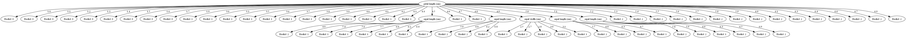
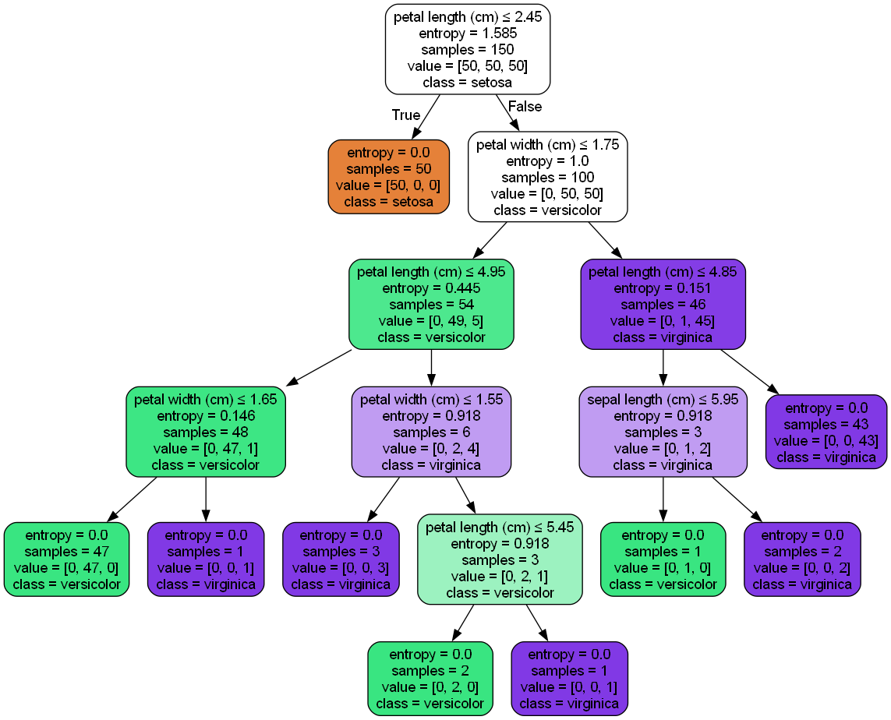

# Decision Tree: Scratch Implementation vs Scikit-learn

This project implements a decision tree classifier on the Iris dataset from scratch using Python, and compares it with `scikit-learn`'s built-in `DecisionTreeClassifier`.

## Project Structure

- `scratch.py` – Manually implemented decision tree using information gain (ID3)
- `tree_utils.py` – Utility functions for entropy, information gain, and tree building
- `visualize_tree()` – Function to visualize the custom-built tree using `graphviz`
- `sklearn_version.py` – Equivalent decision tree using scikit-learn
- `scratch_tree.png` – Visualization of the manually built tree
- `sklearn_tree.png` – Visualization of the sklearn-built tree

## Dataset

The [Iris dataset](https://scikit-learn.org/stable/auto_examples/datasets/plot_iris_dataset.html) consists of 150 samples from three species of iris flowers, with four features:
- sepal length (cm)
- sepal width (cm)
- petal length (cm)
- petal width (cm)

## Scratch Implementation Highlights

- Built entirely from first principles, including:
  - Entropy calculation
  - Information gain
  - Recursive tree construction
- Does not rely on any ML libraries
- Treats continuous features as discrete (each unique value is a branch)
- Visualized with `graphviz` for structural clarity

### Sample Output

**Accuracy** on training set: 100%


**Visualization**:


## Scikit-learn Version

- Uses `DecisionTreeClassifier(criterion='entropy')`
- Automatically handles continuous feature thresholds
- Produces a balanced binary tree

### Sample Output

**Accuracy** on training set: 100%


**Visualization**:


## Key Differences

| Feature                  | Scratch Version                     | Scikit-learn Version                   |
|--------------------------|-------------------------------------|----------------------------------------|
| Feature Splitting        | Information gain (ID3)              | Information gain (ID3)                 |
| Continuous Feature Split | Discrete: one node per unique value | Continuous: optimal threshold search   |
| Tree Type                | Multi-way (very wide)               | Binary                                 |
| Visual Clarity           | Good for understanding internals    | Clean and compact                      |
| Learning Purpose         | High – full control over logic      | High – efficient and production-ready  |

## Dependencies

- `numpy`
- `pandas`
- `scikit-learn`
- `graphviz`

Install with:

```bash
pip install numpy pandas scikit-learn graphviz

